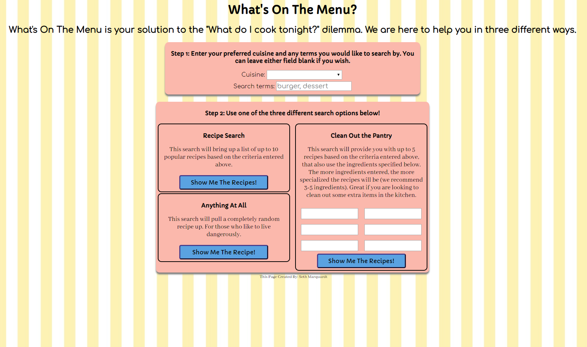
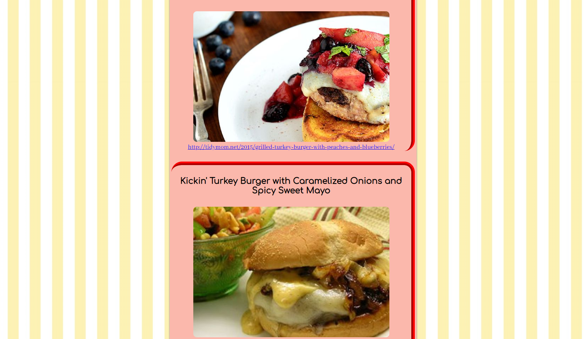

# Recipe Finder

## Demo
- [Live Demo](https://smarquardtwp.github.io/recipe-finder/)

## Screenshots

### _Landing Page_

### _Filled Search Criteria_

### _Search Results_

## Functions
  * Search for recipes based on desired cuisine and other queries
  * Search for recipes based on specific ingredient components, reducing results that don't include these ingredients
  * Search for completely random recipe
  
## Technologies Used

### Languages
  * HTML
  * CSS
  * Javascript
  * Jquery
  
### Software
  * VS Code
  * Postman
  
### API
  *Spoonacular (hosted by RapidApi) [Documentation](https://rapidapi.com/spoonacular/api/recipe-food-nutrition)
  
## Authorship
  *Seth Marquardt
